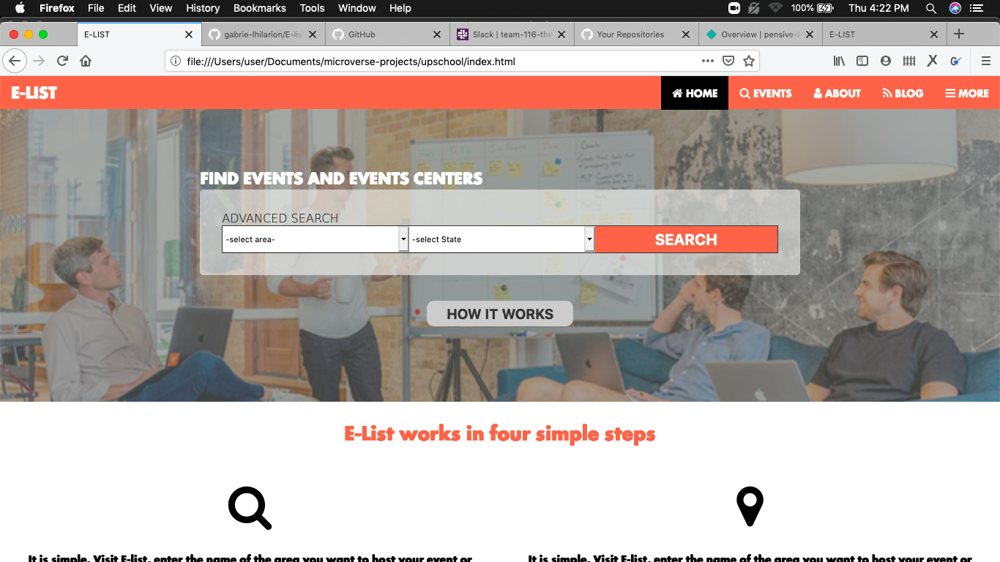

# Project Name

> My HTML & CSS capstone project: Directory of Schools

This project has three pages crafted with HTML and CSS. THe three pages are the homepage, the search page and the details page. 

## Built With

- HTML5,
- CSS3,
- FLEX BOX

## Live Demo

[Live Demo Link](https://pensive-hypatia-53582d.netlify.app)

## Getting Started

 

To get a local copy up and running follow these simple example steps.

### You will need a functional personal computer

### Create a folder in any location of your joice in your compter

### Copy the link of this git repository

### Open your computers command line and move into the directory you made for this project, and clone the repository

### To view this project in the browser just double click any html file

## Authors

👤 **Author1**

- Github: [@githubhandle](https://github.com/githubhandle)
- Twitter: [@twitterhandle](https://twitter.com/twitterhandle)
- Linkedin: [linkedin](https://linkedin.com/linkedinhandle)

## 🤝 Contributing

Contributions, issues and feature requests are welcome!

Feel free to check the [issues page](https://github.com/gabrie-lhilarion/E-list/issues/1).

## Show your support

Give a ⭐️ if you like this project!

## Acknowledgments

- Microverse
- Behence.com
- Teamm 116 of Microverse

## 📝 License

This project is [MIT](lic.url) licensed.
